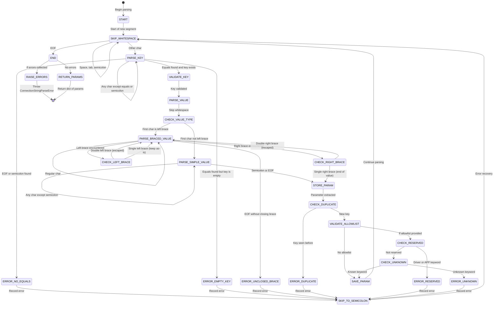

# Connection String Parser State Machine

This document describes the state machine for the ODBC connection string parser (`_ConnectionStringParser`).

## Overview

The parser processes ODBC connection strings character-by-character, handling:
- Semicolon-separated key=value pairs
- Simple values (unquoted)
- Braced values with escape sequences: `{value}`, `}}` → `}`, `{{` → `{`
- Whitespace normalization
- Error detection and collection

## State Machine Diagram



## States Description

### Main States

| State | Description |
|-------|-------------|
| **START** | Initial state at beginning of parsing |
| **SKIP_WHITESPACE** | Skip whitespace (spaces, tabs) and semicolons between parameters |
| **PARSE_KEY** | Extract parameter key up to '=' sign |
| **VALIDATE_KEY** | Check if key is non-empty |
| **PARSE_VALUE** | Determine value type and extract it |
| **CHECK_VALUE_TYPE** | Decide between simple or braced value parsing |
| **PARSE_SIMPLE_VALUE** | Extract unquoted value up to ';' or EOF |
| **PARSE_BRACED_VALUE** | Extract braced value with escape handling |
| **STORE_PARAM** | Prepare to store the key-value pair |
| **CHECK_DUPLICATE** | Verify key hasn't been seen before |
| **VALIDATE_ALLOWLIST** | Check parameter against allowlist (if provided) |
| **CHECK_RESERVED** | Verify parameter is not reserved (Driver, APP) |
| **CHECK_UNKNOWN** | Verify parameter is recognized |
| **SAVE_PARAM** | Store the parameter in results |
| **SKIP_TO_SEMICOLON** | Error recovery: advance to next ';' |
| **END** | Parsing complete |
| **RAISE_ERRORS** | Collect and throw all errors |
| **RETURN_PARAMS** | Return parsed parameters dictionary |

### Error States

| Error State | Trigger | Error Message |
|-------------|---------|---------------|
| **ERROR_NO_EQUALS** | Key without '=' separator | "Incomplete specification: keyword '{key}' has no value (missing '=')" |
| **ERROR_EMPTY_KEY** | '=' with no preceding key | "Empty keyword found (format: =value)" |
| **ERROR_DUPLICATE** | Same key appears twice | "Duplicate keyword '{key}' found" |
| **ERROR_UNCLOSED_BRACE** | '{' without matching '}' | "Unclosed braced value starting at position {pos}" |
| **ERROR_RESERVED** | User tries to set Driver or APP | "Reserved keyword '{key}' is controlled by the driver and cannot be specified by the user" |
| **ERROR_UNKNOWN** | Key not in allowlist | "Unknown keyword '{key}' is not recognized" |

## Special Characters & Escaping

### Braced Value Escape Sequences

| Input | Parsed Output | Description |
|-------|---------------|-------------|
| `{value}` | `value` | Basic braced value |
| `{val;ue}` | `val;ue` | Semicolon allowed inside braces |
| `{val}}ue}` | `val}ue` | Escaped right brace: `}}` → `}` |
| `{val{{ue}` | `val{ue` | Escaped left brace: `{{` → `{` |
| `{a=b}` | `a=b` | Equals sign allowed inside braces |
| `{sp ace}` | `sp ace` | Spaces preserved inside braces |

### Simple Value Rules

- Read until semicolon (`;`) or end of string
- Leading whitespace after '=' is skipped
- Trailing whitespace is stripped from value
- Cannot contain semicolons (unescaped)

## Examples

### Valid Parsing Flow

```
Input: "Server=localhost;Database=mydb"

START → SKIP_WHITESPACE → PARSE_KEY("Server")
  → VALIDATE_KEY → PARSE_VALUE → CHECK_VALUE_TYPE
  → PARSE_SIMPLE_VALUE("localhost") → STORE_PARAM
  → CHECK_DUPLICATE → VALIDATE_ALLOWLIST → SAVE_PARAM
  → SKIP_WHITESPACE → PARSE_KEY("Database")
  → VALIDATE_KEY → PARSE_VALUE → CHECK_VALUE_TYPE
  → PARSE_SIMPLE_VALUE("mydb") → STORE_PARAM
  → CHECK_DUPLICATE → VALIDATE_ALLOWLIST → SAVE_PARAM
  → END → RETURN_PARAMS
```

### Error Handling Flow

```
Input: "Server=localhost;Server=other" (duplicate)

START → ... → SAVE_PARAM(Server=localhost)
  → SKIP_WHITESPACE → PARSE_KEY("Server")
  → VALIDATE_KEY → PARSE_VALUE → ... → STORE_PARAM
  → CHECK_DUPLICATE → ERROR_DUPLICATE
  → SKIP_TO_SEMICOLON → END → RAISE_ERRORS
```

### Braced Value with Escaping

```
Input: "PWD={p}}w{{d;test}"

START → SKIP_WHITESPACE → PARSE_KEY("PWD")
  → VALIDATE_KEY → PARSE_VALUE → CHECK_VALUE_TYPE
  → PARSE_BRACED_VALUE
    - Read 'p'
    - Read '}' → CHECK_RIGHT_BRACE
    - Next is '}' → Escaped: add '}', continue
    - Read 'w'
    - Read '{' → CHECK_LEFT_BRACE
    - Next is '{' → Escaped: add '{', continue
    - Read 'd', ';', 't', 'e', 's', 't'
    - Read '}' → CHECK_RIGHT_BRACE
    - Next is not '}' → End of value
  → STORE_PARAM (value="p}w{d;test")
  → ... → SAVE_PARAM → END → RETURN_PARAMS
```

## Parser Characteristics

### Key Features

1. **Error Collection**: Collects all errors before raising exception (batch error reporting)
2. **Case-Insensitive Keys**: All keys normalized to lowercase during parsing
3. **Duplicate Detection**: Tracks seen keys to prevent duplicates
4. **Reserved Keywords**: Blocks user from setting `Driver` and `APP`
5. **Allowlist Validation**: Optional validation against allowed parameters
6. **Escape Handling**: Proper ODBC brace escape sequences (`{{`, `}}`)
7. **Error Recovery**: Skips to next semicolon after errors to continue validation

### Error Handling Strategy

- **Non-fatal errors**: Continue parsing to collect all errors
- **Fatal errors**: Stop immediately (e.g., unclosed brace in value parsing)
- **Batch reporting**: All errors reported together in `ConnectionStringParseError`

## References

- MS-ODBCSTR Specification: [ODBC Connection String Format](https://learn.microsoft.com/en-us/openspecs/sql_server_protocols/ms-odbcstr/)
- Implementation: `mssql_python/connection_string_parser.py`
- Tests: `tests/test_010_connection_string_parser.py`
